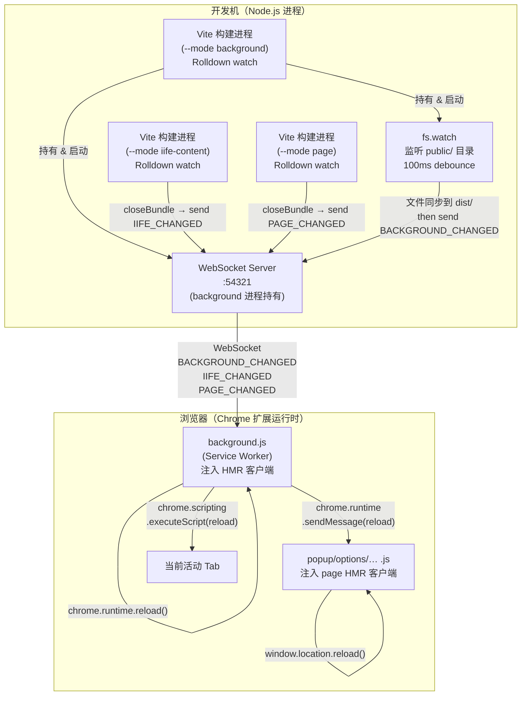
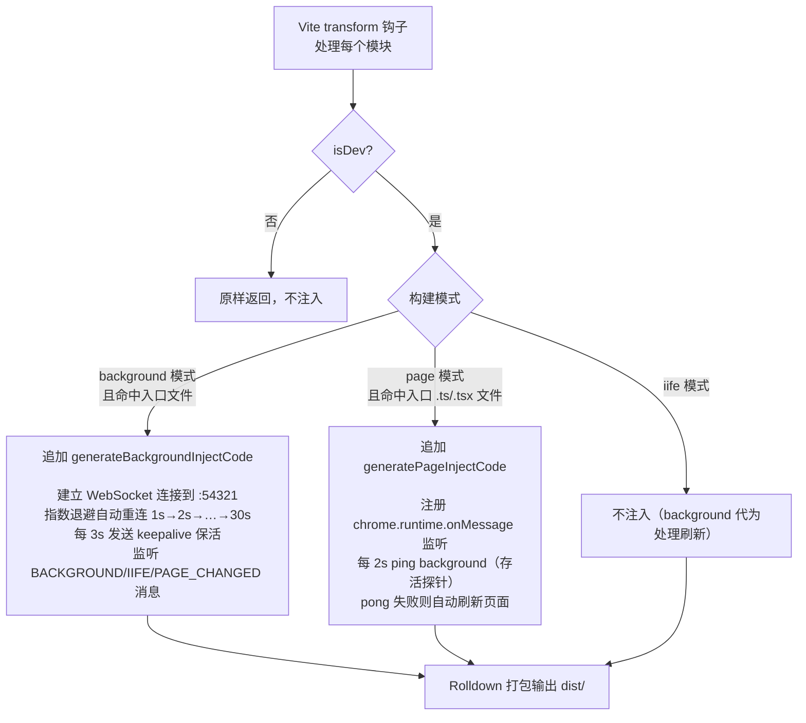
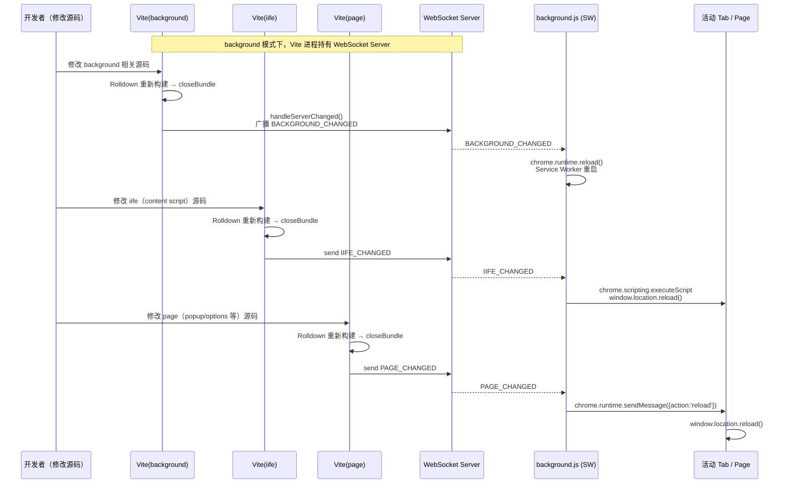
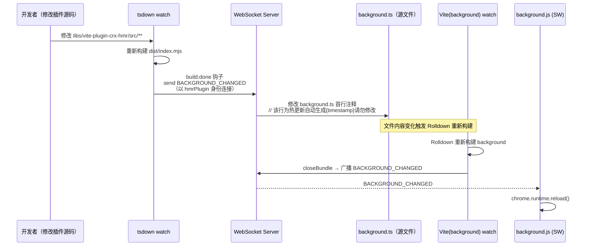
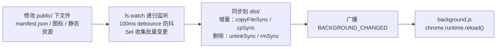

# vite-plugin-crx-hmr

[ ](https://www.npmjs.com/package/@bgafe/vite-plugin-crx-hmr)

用于开发 Chromium manifest v3 插件的 Vite 热更新插件

## 功能介绍

1. 主要提供开发期间的热重载能力，监听文件变化后自动编译浏览器插件，并通知插件 background（Service Worker）自动重新加载、自动刷新页面
2. 该 Vite 插件内部添加了浏览器插件开发常用多入口配置
3. 已自测该 Vite 插件支持使用 React 和 Vue 来开发浏览器插件

## 基本使用

1. 安装依赖

```shell
pnpm add @bgafe/vite-plugin-crx-hmr -D
```

2. 在 vite.config.ts 中使用 crxHmrPlugin

```ts
import { defineConfig } from 'vite'
import react from '@vitejs/plugin-react-swc'
import crxHmrPlugin from '@bgafe/vite-plugin-crx-hmr'

export default defineConfig(async ({ mode }) => {
  const isDev = process.env.NODE_ENV === 'development'

  return {
    plugins: [react(), crxHmrPlugin({ mode, isDev })],
  }
})
```

3. 根据截图里的说明信息新建你业务所需的入口、新建并配置 public/manifest.json、配置 package.json 的 scripts


## 扩展配置

1. 如果要新增 iife 脚本，直接新建对应入口，在 package.json 的 script 中添加相应的 build:xxx 即可

2. 插件内部针对 build:page（构建所有页面入口命令）预置了这些入口「newtab、history、bookmarks、popup、options、side-panel、devtools、devtools-panel、elements-sidebar-pane、recorder、update-version、sandbox、main」


如果这些默认页面入口名称不能满足你的业务需求，可在 vite.config.ts 中初始化 crxHmrPlugin 时通过 pageInput 参数指定新的页面入口

```ts
import { defineConfig } from 'vite'
import react from '@vitejs/plugin-react-swc'
import crxHmrPlugin from '@bgafe/vite-plugin-crx-hmr'
import { resolve } from 'path'

export default defineConfig(async ({ mode }) => {
  const isDev = process.env.NODE_ENV === 'development'

  return {
    plugins: [
      react(),
      crxHmrPlugin({
        mode,
        isDev,
        // 通过 pageInput 增加新的页面入口
        // 仅需指定页面名称记录，例如指定 ['page1']，则插件内部会自动添加 resolve(process.cwd(), 'src/entries/page1/page1.html')
        pageInput: ['page1', 'page2'],
      }),
    ],
  }
})
```

## 原理

### 整体架构

插件将 Chrome 扩展开发中的多种模式（background、iife、page）拆分为独立的 Vite 构建进程，通过一个中心化的 WebSocket HMR 服务协调它们之间的热更新通信。



### 构建时：代码注入（transform 钩子）

Vite 在 `transform` 阶段，插件会向入口文件追加 HMR 客户端代码，使浏览器端具备接收热更新信号的能力。



### 运行时：HMR 消息流转

文件变更后，消息在 Node.js 进程与浏览器之间的完整传递链路：



### 特殊场景：插件自身代码变更（tsdown watch）

当 Vite 插件的 Node.js 源码（`libs/vite-plugin-crx-hmr`）在 watch 模式下重新构建完成时，需要触发扩展重载。由于此时没有 Vite 构建进程接管，`tsdown.config.ts` 中的 `build:done` 钩子扮演了触发者角色：



### public 目录变更同步

`manifest.json`、图标等静态资源修改无需重新编译，插件通过 `fs.watch` 直接同步到 `dist/` 并触发扩展重载：


